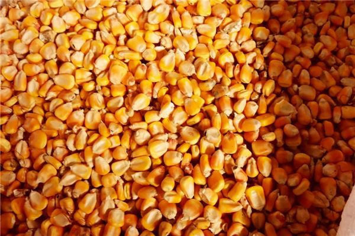
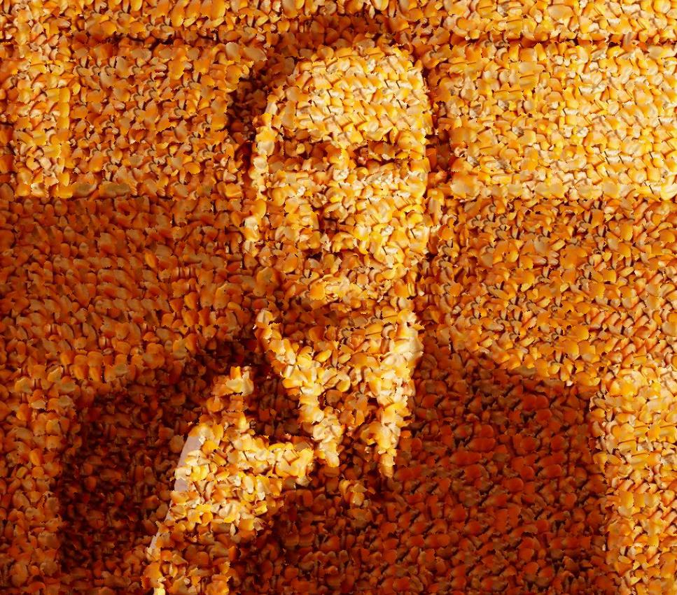
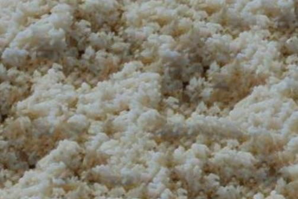
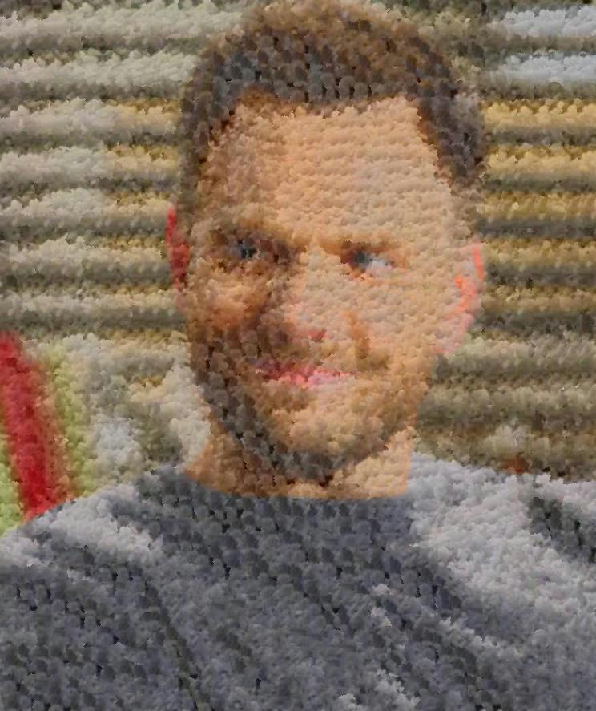

## Description
This repo basically implement :

Alexei A. Efros and William T. Freeman. 2001. Image quilting for texture synthesis and transfer. In Proceedings of the 28th annual conference on Computer graphics and interactive techniques (SIGGRAPH '01). Association for Computing Machinery, New York, NY, USA, 341–346. DOI:https://doi.org/10.1145/383259.383296

texture_transfer.py is the original algorithm.

texture_transfer_M.py is a modification. It only paste the texture's luminance and keep the original image's color. The texture_transfer.py pastes both texture's luminance and color.

  

## Packages
Python 3.8.10
* argparse                    1.1
* scipy                   1.6.3
* opencv                    4.5.2
* pillow                    8.0.0
* numpy                     1.20.3

## Usage
usage: texture_transfer.py [-h] --text TEXTURE_PATH --picture PIC_PATH
                           --outname OUTNAME [--overlap_len OVERLAP_LEN]
                           [--patchsize PATCHSIZE] [--random RANDOM]

optional arguments:
  -h, --help            show this help message and exit

 --text TEXTURE_PATH, -t TEXTURE_PATH
                        path of texture image

  --picture PIC_PATH, -p PIC_PATH
                        path of source image

  --outname OUTNAME, -o OUTNAME
                        name of the output image

  --overlap_len OVERLAP_LEN
                        the size of the overlap region between the patches

  --patchsize PATCHSIZE
                        size of the patches

  --random RANDOM      
                        random choose patch in some similar patches, 0~9. This value becomes bigger, then #candicates of patches becomes larger. 0 is choose the most similar patch.That is #candicates of patches is one.
